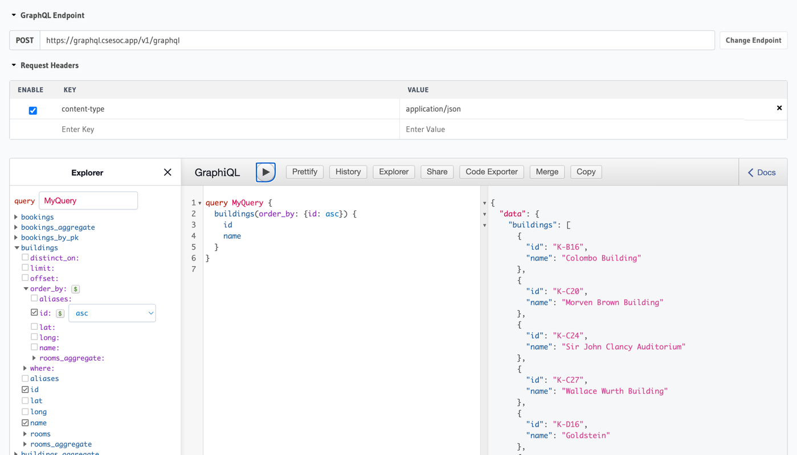

# DevSoc GraphQL API - powered by Hasura & Postgres

This page explains the purpose of the DevSoc GraphQL API and how to use it as a client. For DevSoc teams looking to connect a new scraper to Hasuragres please see [here](scrapers.md).

## About Hasuragres

DevSoc provides a GraphQL API for all the data scraped and used for its various projects. In contrast to other unis, UNSW lacks public APIs for much of its data. We hope to fill that gap, so that other students may use this data to power their own personal projects.

This API provides data on:
- Buildings, rooms and room bookings (as seen in Freerooms)
- Course and class schedules (as seen in Notangles)
- **[COMING SOON]** Course information (as seen in Circles and Unilectives)

The full schema can be found [here](https://devsoc.atlassian.net/wiki/spaces/GA/pages/184352772/Schema).

Our API is powered by [Hasura](https://hasura.io/) - a powerful tool that hooks in to an existing database and automatically generates and exposes a rich GraphQL API for the data stored within. The underlying database we use is [Postgres](https://www.postgresql.org/), hence the name **Hasuragres**.

## Interactive Explorer


You can explore Hasuragres using our [interactive explorer](https://cloud.hasura.io/public/graphiql?endpoint=https%3A%2F%2Fgraphql.csesoc.app%2Fv1%2Fgraphql). In this explorer, you can:
- See the full GraphQL schema
- Experiment with building your own queries
- Execute queries on the data
- Generate code to execute queries programmatically

## Querying Hasuragres

To query the data available in Hasuragres, you can send a GraphQL request to `https://graphql.csesoc.app/v1/graphql`. For more information on the different kind of queries you can make with the Hasura GraphQL API, see [the docs](https://hasura.io/docs/latest/queries/postgres/index/#exploring-queries).

There should be a large selection of GraphQL libraries for each language, you can explore them [here](https://graphql.org/code) and select the one which best suits your project. As one example, you can see how Freerooms does queries in TypeScript [here](https://github.com/devsoc-unsw/freerooms/blob/dev/backend/src/dbInterface.ts).

### Example

Here is an example query to fetch all buildings at UNSW that have a room with capacity greater than some specified value, along with all of those rooms sorted in descending order of capacity:
```gql
query MyQuery($capacity: Int) {
  buildings(where: {rooms: {capacity: {_gt: $capacity}}}) {
    id
    name
    rooms(where: {capacity: {_gt: $capacity}}, order_by: {capacity: desc}) {
      id
      name
      capacity
    }
  }
}
```

Here's an example of how we might send this query using JavaScript (generated using the interactive explorer linked above!):
```ts
async function fetchGraphQL(query, variables) {
  const result = await fetch('https://graphql.csesoc.app/v1/graphql', {
    method: 'POST',
    body: JSON.stringify({
      query,
      variables,
    }),
  });
  return await result.json();
}

const query = `
  query MyQuery($capacity: Int) {
    buildings(where: {rooms: {capacity: {_gt: $capacity}}}) {
      id
      name
      rooms(where: {capacity: {_gt: $capacity}}, order_by: {capacity: desc}) {
        id
        name
        capacity
      }
    }
  }
`;

fetchGraphQL(query, { capacity: 100 })
  .then(({ data, errors }) => {
    if (errors) {
      console.error(errors);
    }
    console.log(data);
  })
  .catch(error => {
    console.error(error);
  });
```

Here is a snippet of what this query might return:
```json
{
  "data": {
    "buildings": [
      {
        "id": "K-J17",
        "name": "Ainsworth Building",
        "rooms": [
          {
            "id": "K-J17-G03",
            "name": "Ainsworth G03",
            "capacity": 350
          }
        ]
      },
      {
        "id": "K-D23",
        "name": "Mathews Theatres",
        "rooms": [
          {
            "id": "K-D23-201",
            "name": "Mathews Theatre A",
            "capacity": 472
          },
          {
            "id": "K-D23-203",
            "name": "Mathews Theatre B",
            "capacity": 246
          },
          {
            "id": "K-D23-303",
            "name": "Mathews Theatre C",
            "capacity": 110
          },
          {
            "id": "K-D23-304",
            "name": "Mathews Theatre D",
            "capacity": 110
          }
        ]
      }
    ]
  }
}
```

